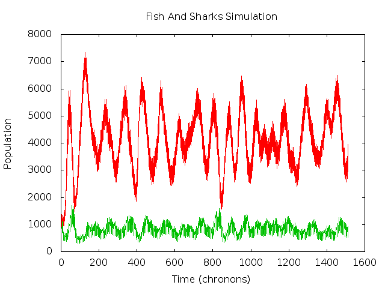
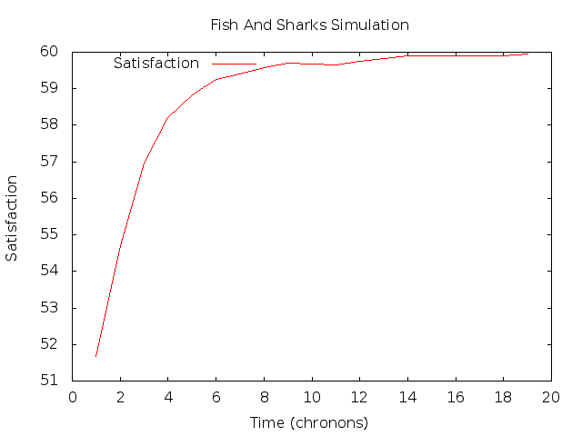

MultiAgentSystems
============
Auteurs:  
Célia CACCIATORE,  
Jonathan GEOFFROY

------------------------------------
Deux systèmes multi-agents sont présentés dans ce projet dans le cadre du cours Intelligence Des Logiciels (IDL), Master 2 Informatique, spécialité IAGL, Université Lille1 :
* FishAndSharks : Implémentation de [Wa-Tor](https://en.wikipedia.org/wiki/Wa-Tor) 
* Segregation : Implémentation du [Modèle de Ségrégation de Schelling](http://www.gemass.fr/dphan/complexe/schellingfr.html)

------------------------------------
# Système multi-agents #

La partie qui gère le système multi-agents est générique et commune aux deux projets.

## Agent: Comportement ##
Chaque *Agent* a son propre comportement ; il possède une méthode *doIt()* qui lui permet de jouer son tour dans la simulation. Cette méthode est donc l'implémentation du comportement de cet *Agent*.

## Environment: Modèle ##
Le modèle est entièrement contenu dans la classe *Environment.java*, qui référence non seulement tous les agents, mais également leur emplacement dans la map.  
De plus, cette classe possède plusieurs **helpers** afin d'informer les *Agent*s sur l'état de l'environnement, comme par exemple la liste de ses voisins, ou encore la prochaine place libre proche de lui.

## MAS: Système Multi-Agent ##
Afin d'obtenir une simulation qui soit **Multi-Agent**, la classe *MAS.java* récupère tous les *Agent*s contenus dans l'*Environment* afin de leur permettre de jouer leurs actions.  

------------------------------------
# FishAndSharks #

## Exécution ##
Afin d'exécuter facilement l'application, un script maven est fourni:

    git clone https://github.com/CeliaDoolaeghe/MultiAgentSystems.git
    cd MultiAgentSystems
    mvn install
    mvn exec:java -PfishAndSharks -Dexec.args="100 2000 900 2 6 4 50"
    
Quand la simulation est terminée, il est possible de générer des graphes avec la commande suivante :
    
    gnuplot *.plot
  
### Arguments ###
Les différents paramètres de la simulation doivent être donnés en tant que paramètres de la commande maven:

|                   Paramètre                  | Valeur Conseillée |
|:--------------------------------------------:|:-----------------:|
| taille de la mer                             | 100               |
| nombre de poissons au début de la simulation | 2000              |
| nombre de requins au début de la simulation  | 900               |
| temps de gestation des poissons              | 2                 |
| temps de gestation des requins               | 6                 |
| temps avant qu'un requin meurt de faim       | 4                 |
| délai d'attente entre 2 tours                | 50                |

Soit la commande suivante pour exécuter la simulation conseillée:

    mvn exec:java -PfishAndSharks -Dexec.args="100 2000 900 2 6 4 50"
  
### Interface Graphique  ###
L'interface graphique fournie présente l'environnement sous forme de ronds de couleurs:

 * bleu pour un poisson,
 * rouge pour un requin,
 * gris clair pour une case vide.
  
### Génération de graphiques ###
Afin de générer automatiquement les graphiques correspondant à la simulation, deux fichiers gnuplot sont fournis:

 * **simulationFishAndShark.plot** crée un nuage de points en fonction du nombre de poissons et de requins 
 * **simulationTime.plot** crée un diagramme affichant le nombre de poissons et de requins en fonction du temps

Il existe aussi **population.csv** qui contient les données des âges des poissons et requins, mais que nous n'avons pas su passer en plot.

Les courbes obtenues :
 * deux courbes sinusoïdales représentant les popuplations des poissons et requins au cours du temps. Quand le nombre de requins augmentent, le nombre de poissons diminuent et vice-versa.
 * une ellipse pleine quand on représente la population de poissons par rapport à celle des requins.

   
 

## Structure du projet ##

Il existe deux types d'agents : les poissons (Fish) et les requins (Sharks).

### Fish: Poisson ###
Le comportement d'un poisson est de tenter de se déplacer si possible, c'est-à-dire si au moins une case adjacente est libre. Le poisson essaye ensuite dans le même tour de donner vie à un autre poisson si cela lui est possible, c'est-à-dire s'il est arrivé au bout de sa gestation et si au moins une case adjacente est libre pour y placer le nouveau poisson. S'il est impossible de donner naissance, la gestation repart de zéro. Il vieillit à chaque tour.

### Shark: Requin ###
En premier, le requin vérifie qu'il n'est pas déjà mort de faim ; si tel est le cas, il se supprime de l'environnement. Dans le cas contraire, il tente d'abord de manger un poisson si celui-ci est sur une case adjacente. Il tente ensuite de faire naitre un nouveau requin, avant de se déplacer si cela lui est possible, en suivant les mêmes règles que pour le poisson. Il vieillit à chaque tour.

------------------------------------
# Segregation #

## Exécution ##
Afin d'exécuter facilement l'application, un script maven est fourni:

    git clone https://github.com/CeliaDoolaeghe/MultiAgentSystems.git
    cd MultiAgentSystems
    mvn install
    mvn exec:java -Psegregation -Dexec.args="100 1000 500 50 50"
    
Quand la simulation est terminée, il est possible de générer des graphes avec la commande suivante :
    
    gnuplot *.plot
  
### Arguments ###
Les différents paramètres de la simulation doivent être donnés en tant que paramètres de la commande maven:

|                   Paramètre                  | Valeur Conseillée |
|:--------------------------------------------:|:-----------------:|
| taille de la ville                           | 100               |
| nombre d'agents verts                        | 1000              |
| nombre d'agents rouges                       | 500               |
| seuil de tolérance (en pourcentage)          | 50                |
| délai d'attente entre 2 tours                | 50                |

Soit la commande suivante pour exécuter la simulation conseillée:

    mvn exec:java -Psegregation -Dexec.args="100 1000 500 50 50"
  
### Interface Graphique  ###
L'interface graphique fournie présente l'environnement sous forme de ronds de couleurs:

 * vert pour un agent vert,
 * rouge pour un agent rouge,
 * gris clair pour une case vide.
  
### Génération de graphiques ###
#### Seuil de Tolérance = 30 #### 
  

#### Seuil de Tolérance = 50 ####
  

## Structure du projet ##

### SegregationAgent ###
L'agent se déplace si son niveau de satisfaction est inférieur à son seuil de tolérance. Le niveau de satisfaction est le nombre de voisins ayant la même couleur que lui sur le nombre total de voisins possibles (les agents sur le bord de la map ne sont pas désavantagés).
